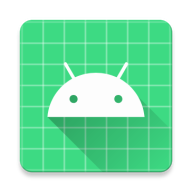

# 🎸 Chrd - A Multiplatform Guitar Chords & Tabs App

[](https://chrd.procyk.in)
[](https://github.com/avan1235/chrd/releases/latest)
[](https://github.com/avan1235/chrd/releases/latest)

[](https://github.com/avan1235/chrd/actions/workflows/client.yml)
[](https://github.com/avan1235/chrd/releases/latest)

[](https://github.com/avan1235/chrd/stargazers)
[](https://github.com/avan1235/chrd/fork)

## 📱 Overview

<div style="display: flex; justify-content: center; flex-wrap: nowrap;">
  
</div>

Chrd is a modern, responsive guitar chords and lyrics application built with Kotlin Multiplatform (KMP) and Compose Multiplatform (CMP). It empowers musicians to search songs across multiple origins, view dynamic chord fingerings, transpose keys in real-time, auto-scroll lyrics while playing, and save songs locally for reliable offline access across all major platforms.

Web version is publicly available at https://chrd.procyk.in.

If you like the project, consider supporting it by leaving ⭐.

## 🚀 Features

- ✅ **Unified Multi-Source Song Search**: Search across multiple song and chord repositories simultaneously (such as Ultimate Guitar and Subversion PL/EN origins), complete with intelligent fuzzy ranking via **FuzzyKot** for fast and accurate results.
- ✅ **Interactive Chord Diagrams & Fingering**: Dynamically rendered fretboard diagrams for every chord in a song, with on-click chord lookup dialogs showing fingerings and voicing details.
- ✅ **Real-Time Key Transposition**: Transpose song pitch by half-tone increments up or down seamlessly on the fly, automatically recomputing chords across all verse, chorus, and bridge sections.
- ✅ **Hands-Free Auto-Scrolling**: Built-in smooth auto-scrolling with fine-grained playback speed adjustment (`+` / `-`), pause/resume controls, and screen wake lock (`keepScreenOn`) for uninterrupted playing sessions.
- ✅ **Offline-First Songbook & Favorites**: Bookmark favorite songs into a local SQLite database powered by **Room Multiplatform**, caching entire chord sheets and metadata for full offline functionality without network connectivity.
- ✅ **Modern & Adaptive UI**: Material Design 3 design system supporting Light, Dark, and System theme modes, along with an optional **Liquid Glass navigation** bar featuring fluid damped drag animations and backdrop blurs (**Backdrop** & **Shapes**).
- ✅ **True Multiplatform Support**: Identical declarative UI and shared business logic deployed to Android, iOS, Desktop (Windows, macOS, Linux), and Web (WebAssembly / WasmJS & JS).

## 🛠️ Technology Stack

- **Kotlin Multiplatform (KMP)** - Core domain models, networking, parsing logic, and viewmodels shared across all targets.
- **Compose Multiplatform (CMP)** - Shared declarative UI framework delivering native performance across Android, iOS, Desktop, and Web.
- **Room Multiplatform (`androidx.room3`)** - Type-safe local SQLite database abstraction with migrations and reactive Flow queries.
- **SQLite Web / Wasm** - WebAssembly-based SQLite database engine (`@sqlite.org/sqlite-wasm` via Web Worker) enabling persistent Room storage in web browsers.
- **Ksoup & Ksoup Network** - Cross-platform HTML scraping and parsing engine to extract song listings and chord content from online song providers.
- **Ktor Client** - Asynchronous HTTP networking with multiplatform engine support and CORS proxy routing for web clients.
- **FuzzyKot** - Fuzzy string search and scoring library to rank song titles and artists effectively.
- **Backdrop & Shapes** - Visual effects library delivering frosted glass blur, backdrop layers, and custom capsule shapes.
- **AndroidX Navigation 3 & Lifecycle ViewModel Compose** - Type-safe navigation backstack management and lifecycle-aware state handling.
- **Kotlinx Coroutines, Serialization & DateTime** - Reactive asynchronous programming, JSON serialization, and cross-platform date/time utilities.

## 💻 Supported Platforms

The application supports:
- 📱 **Android**: Target SDK 35, Compile SDK 37, Min SDK 35. Native Android launcher leveraging Compose Multiplatform.
- 🍎 **iOS**: Native Xcode workspace and SwiftUI entry point hosting the shared Compose Multiplatform canvas (iOS Arm64 & Simulator).
- 🖥️ **Desktop**: Cross-platform JVM application targeting Windows (`.msi`), macOS (`.dmg`), and Linux (`.deb`).
- 🌐 **Web**: High-performance Web application compiled with **WebAssembly (WasmJS)** and JavaScript, with service worker caching for offline readiness.

## 🏗️ Project Structure

```
chrd
├── androidApp          # Android launcher module (targetSdk 35, compileSdk 37)
│   └── src
│       └── main        # AndroidManifest, MainActivity, and launcher mipmap resources
├── desktopApp          # Desktop JVM launcher module with native packaging configurations
│   └── src
│       └── jvmMain     # Desktop entry point (in.procyk.chrd.MainKt)
├── iosApp              # iOS native Xcode project (SwiftUI entry point & assets)
│   ├── iosApp          # iOSApp.swift, ContentView.swift, assets
│   └── Configuration   # Xcode build configurations
├── webApp              # WebAssembly (WasmJS) & JavaScript browser launcher module
│   └── src
│       ├── wasmJsMain  # WasmJS entry point
│       ├── jsMain      # JavaScript entry point
│       └── webMain     # HTML index, PWA icons, and service worker
└── shared              # Shared Compose Multiplatform UI & core logic
    ├── src
    │   ├── commonMain  # Shared UI screens, ViewModels, Room DB, Chord models, and scrapers
    │   ├── androidMain # Android database driver and UI preview tools
    │   ├── jvmMain     # Desktop SQLite driver implementation
    │   ├── iosMain     # iOS SQLite driver implementation
    │   ├── jsMain      # Web JS SQLite Web Worker integration
    │   └── wasmJsMain  # Web WasmJS SQLite Web Worker integration
    └── schemas         # Room database schema definitions
```

## 🚀 Getting Started

### Prerequisites

- **JDK 21** or higher
- **Android Studio** or **IntelliJ IDEA** (with Kotlin Multiplatform & Compose plugins)
- **Xcode** (for iOS builds, macOS only)

### Development Commands

A `Makefile` is provided for common development tasks:

#### Running the Clients

1. **Run Desktop App (JVM with hot reload)**:
   ```bash
   make dev
   ```
2. **Run Desktop App (Production distributable)**:
   ```bash
   make desktop
   ```
3. **Run Web App (WebAssembly in browser)**:
   ```bash
   make wasm
   ```
4. **Run Android App**:
   ```bash
   ./gradlew :androidApp:assembleDebug
   ```
   Or select and run `androidApp` in Android Studio / IntelliJ IDEA.
5. **Run iOS App**:
   Open the Xcode workspace inside `iosApp/iosApp.xcworkspace` (or `iosApp.xcodeproj`) on macOS and run.

#### Running Tests

- **Run Desktop JVM tests**:
  ```bash
  ./gradlew :shared:jvmTest
  ```
- **Run Android Host tests**:
  ```bash
  ./gradlew :shared:testAndroidHostTest
  ```
- **Run Web tests (Wasm & JS)**:
  ```bash
  ./gradlew :shared:wasmJsTest
  ./gradlew :shared:jsTest
  ```
- **Run iOS tests** (macOS only):
  ```bash
  ./gradlew :shared:iosSimulatorArm64Test
  ```

#### Cleanup

Clean build artifacts:
```bash
make clean
```

## 📄 License

This project is licensed under the MIT License - see the LICENSE file for details.

## 👨‍💻 Author

Maciej Procyk